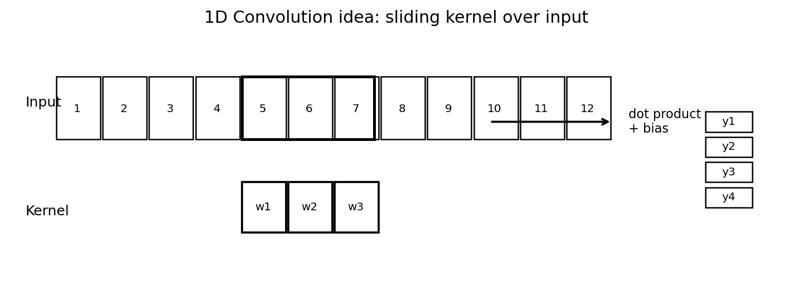
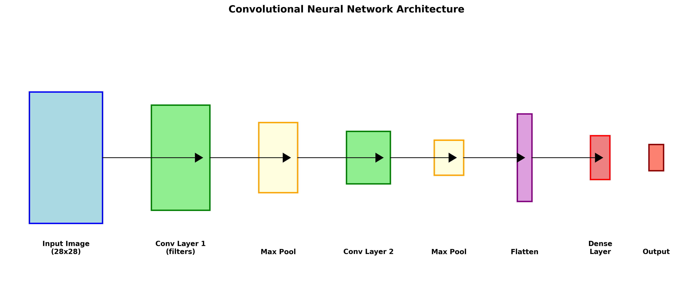
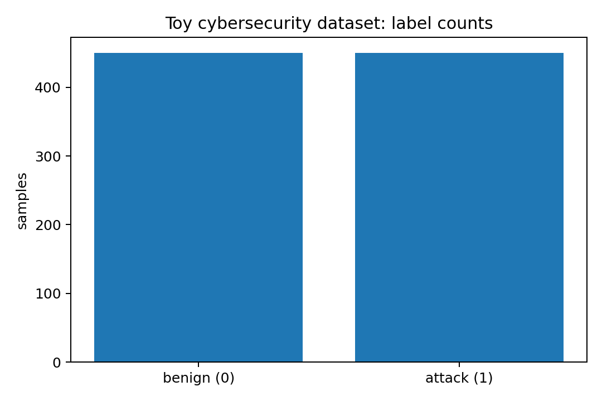
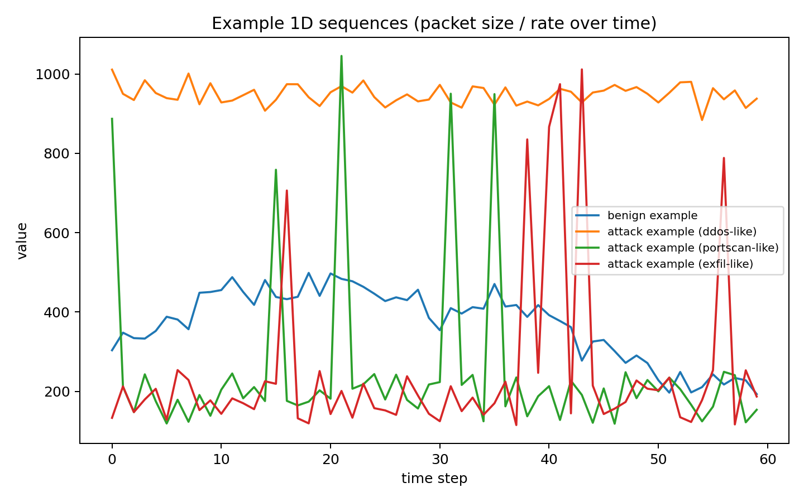

# Convolutional Neural Network (CNN)

## 1. What is a CNN?

A **Convolutional Neural Network (CNN)** is a type of neural network that is very good at learning patterns from
data that has a *shape* (for example: an image grid, an audio signal, or a time series).  
Instead of connecting every input to every neuron (like a simple fully-connected network), a CNN uses **small filters**
(also called **kernels**) that *slide* over the input. This makes the model:
- **faster** (less parameters),
- **better at local patterns** (edges, spikes, short sequences),
- **more stable** to small shifts (like moving an object in an image, or moving an event in time).

## 2. Main building blocks

### Convolution layer
A convolution layer applies many small filters to the input. Each filter produces a **feature map**.
A feature map is like “where this pattern exists”.

### Activation (ReLU)
After convolution, we often use **ReLU**: `ReLU(x) = max(0, x)`.  
It keeps positive values and removes negative values, so learning becomes easier.

### Pooling layer
Pooling (like **Max Pooling**) reduces the size of feature maps.
It keeps the strongest signals and makes the model less sensitive to small shifts.

### Fully connected (Dense) layer
At the end, we often use one or more **Dense** layers to make the final decision,
like “benign” vs “attack”.

### Regularization (Dropout)
**Dropout** randomly turns off some neurons during training.  
This helps reduce **overfitting** (when the model memorizes training data instead of learning general rules).

## 3. Visualizations

### 3.1 Convolution idea (1D)



### 3.2 Example CNN architecture (1D)



### 3.3 Toy cybersecurity data examples





## 4. Why CNN is useful (simple explanation)

CNN learns **small patterns** first, then combines them into **bigger patterns**.  
For images, a small pattern can be an edge. For cybersecurity time series, a small pattern can be:
- a short burst of traffic,
- repeated spikes (port scan style),
- a constant high load (DDoS style),
- a periodic pattern (chunked exfiltration).

Because the filter slides, CNN can detect the same pattern even if it happens earlier or later.

## 5. Practical cybersecurity example: Detect attacks from traffic sequences

In this example we use a **1D CNN** to classify network behavior using a sequence of 60 values per sample.
You can imagine each value as a **packet size** or **packet rate** in a short time window.

### Dataset (included)
I generated a small toy dataset file:

- `toy_netflow_sequences.csv`
- 60 features: `f0 ... f59`
- label: `0 = benign`, `1 = attack`

This is **synthetic data** (not real captured traffic), but it is good to practice the workflow.

### Python code (training a 1D CNN)

```python
# Practical CNN example for cybersecurity (B1 level comments)
# Task: classify benign vs attack from a 1D sequence of traffic values.

# 1) Install packages (run in terminal if needed)
# pip install pandas numpy scikit-learn tensorflow matplotlib

import pandas as pd
import numpy as np
from sklearn.model_selection import train_test_split
from sklearn.metrics import classification_report, confusion_matrix

import tensorflow as tf
from tensorflow.keras import layers, models

# 2) Load data
df = pd.read_csv("toy_netflow_sequences.csv")
X = df[[f"f{i}" for i in range(60)]].values
y = df["label"].values

# 3) Scale values (simple)
X = (X - X.mean(axis=0)) / (X.std(axis=0) + 1e-9)

# 4) CNN expects shape: (samples, time_steps, channels)
X = X.reshape(-1, 60, 1)

X_train, X_test, y_train, y_test = train_test_split(
    X, y, test_size=0.25, random_state=42, stratify=y
)

# 5) Build a small 1D CNN
model = models.Sequential([
    layers.Input(shape=(60, 1)),
    layers.Conv1D(filters=32, kernel_size=5, padding="same"),
    layers.ReLU(),
    layers.MaxPooling1D(pool_size=2),

    layers.Conv1D(filters=64, kernel_size=3, padding="same"),
    layers.ReLU(),
    layers.GlobalAveragePooling1D(),

    layers.Dropout(0.3),
    layers.Dense(1, activation="sigmoid")  # binary classification
])

model.compile(
    optimizer="adam",
    loss="binary_crossentropy",
    metrics=["accuracy"]
)

# 6) Train
history = model.fit(
    X_train, y_train,
    validation_split=0.2,
    epochs=15,
    batch_size=32,
    verbose=1
)

# 7) Evaluate
pred_prob = model.predict(X_test).ravel()
pred = (pred_prob >= 0.5).astype(int)

print(classification_report(y_test, pred))

cm = confusion_matrix(y_test, pred)
print("Confusion matrix:")
print(cm)

# 8) Optional: save model
model.save("cnn_netflow_detector.keras")
```

### What this CNN learns (simple)

- The first Conv1D layer can learn *short* patterns, like small spikes.  
- The second Conv1D layer can combine these into bigger patterns, like repeated spikes or long bursts.  
- Pooling reduces noise and keeps strong signals.  
- The final Dense layer outputs a probability: **attack** or **benign**.

## 6. Tips and limitations

- **Real data is messy**: in real networks you need feature engineering (flows, packet stats, bytes, flags).
- **Class imbalance** is common: attacks can be rare. Use balanced sampling or class weights.
- **Explainability**: you can inspect filters or use methods like saliency maps, but it is not always easy.
- **Overfitting**: use dropout, early stopping, and more data.

## 7. Summary

A CNN uses **convolution filters** to learn patterns from structured data.
It is strong for images and also for cybersecurity time series.
With a **1D CNN**, you can detect suspicious traffic behavior like scans, DDoS, or exfiltration bursts.
The included dataset and code show a basic pipeline: load data → reshape → train CNN → evaluate.
