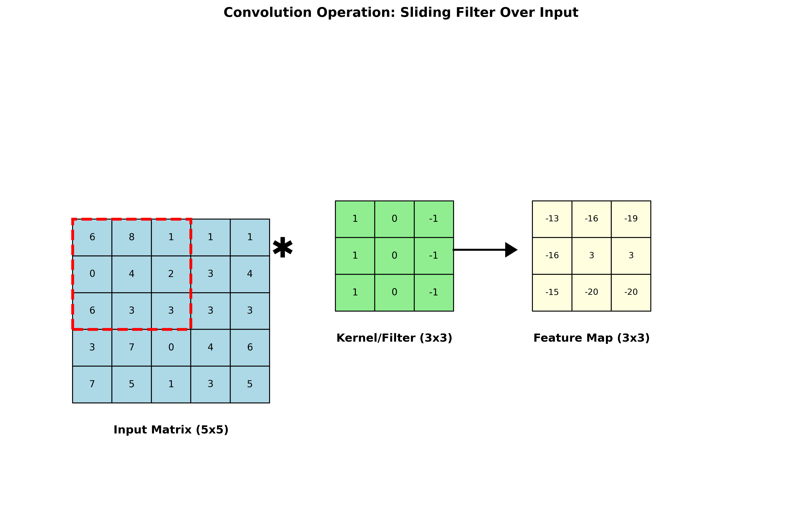
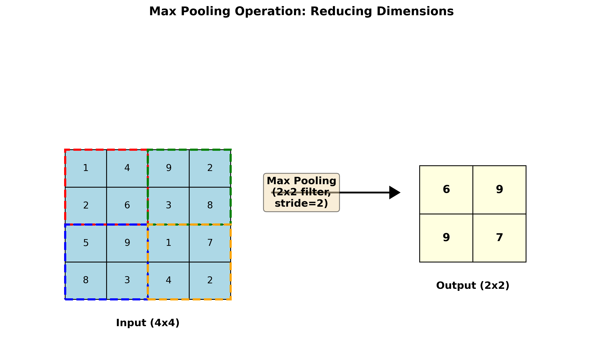

# Convolutional Neural Network (CNN)

## What is CNN?

Convolutional Neural Network, or CNN, is a special type of artificial intelligence that is really good at working with images and visual data. It was created to copy how our human brain sees and understands pictures. The name comes from a mathematical operation called "convolution" that the network uses to process information.

CNNs are different from regular neural networks because they can automatically learn important features from images without us telling them what to look for. For example, if you show a CNN many pictures of cats, it learns by itself to recognize things like ears, whiskers, and eyes. This makes CNNs very powerful for tasks like recognizing faces, detecting objects, or even reading handwritten text.

## How Does CNN Work?

A CNN has several important parts that work together like a team. Let me explain each part in a simple way:


### 1. Convolutional Layers

This is the most important part of CNN. The convolutional layer uses small filters (also called kernels) that slide over the image like a moving window. These filters are usually 3x3 or 5x5 pixels in size. When the filter moves across the image, it does mathematical calculations to find patterns.

For example, one filter might learn to detect horizontal lines, another filter finds vertical lines, and another one finds curves. In deeper layers, filters can detect more complex things like shapes or even parts of objects.



The picture above shows how convolution works. The filter (also called kernel) moves over the input matrix and creates a new output called a "feature map". This feature map shows where certain patterns were found in the original image.

### 2. Activation Function (ReLU)

After convolution, we use something called ReLU (Rectified Linear Unit). This is a simple function that helps the network learn better. ReLU looks at all the numbers from convolution and changes negative numbers to zero, but keeps positive numbers the same.

Why do we need this? Because it helps the network learn complex patterns and makes the calculations faster. It's like a filter that removes unnecessary information.

### 3. Pooling Layers

Pooling layers make the data smaller and simpler. The most common type is "max pooling". It looks at a small area (like 2x2 pixels) and only keeps the biggest number from that area. This helps in two ways:

- It makes the data smaller, so the computer needs less memory
- It makes the network focus on the most important features and ignore small details



In the picture above, you can see how max pooling takes a 4x4 input and creates a 2x2 output by keeping only the maximum value from each 2x2 region. This reduces the size by 75%!

### 4. Fully Connected Layers

After several convolutional and pooling layers, the data goes to fully connected layers. These layers are like regular neural networks. They take all the features that were found and combine them to make the final decision.

For example, if we're trying to recognize if a picture shows a cat or a dog, the fully connected layers look at all the features (ears, nose, fur pattern, etc.) and decide which animal it is.

### 5. Output Layer

The last layer gives us the final answer. If we're classifying images into 10 different categories, this layer will have 10 numbers. Each number shows how confident the network is that the image belongs to that category.

## Why CNN is Special?

CNNs have some important advantages that make them better than other methods for working with images:

**Automatic Feature Learning**: In old computer vision methods, programmers had to manually tell the computer what features to look for. With CNN, the network learns these features automatically from the training data.

**Parameter Sharing**: The same filter is used across the whole image. This means we need fewer parameters (numbers to learn), which makes the network more efficient and less likely to overfit.

**Translation Invariance**: CNN can recognize an object no matter where it appears in the image. A cat in the top-left corner looks the same to a CNN as a cat in the bottom-right corner.

**Hierarchical Learning**: Early layers learn simple patterns (lines, edges), middle layers learn medium complexity (shapes, textures), and deep layers learn complex objects (faces, animals).

## Real Application: Network Intrusion Detection in Cybersecurity

Now, let me show you a practical example of how CNN can be used in cybersecurity. We will build a simple CNN that can detect malicious network traffic and protect computer systems from attacks.

### The Problem

When hackers try to attack a computer network, they send malicious data packets. These packets look different from normal network traffic. We can use CNN to analyze this traffic and detect attacks automatically.

For this example, we'll use network traffic data where each packet is converted into a small image-like representation. The CNN will learn to distinguish between normal traffic and different types of attacks.

### Python Code Implementation

```python
import numpy as np
import pandas as pd
from sklearn.model_selection import train_test_split
from sklearn.preprocessing import StandardScaler, LabelEncoder
import tensorflow as tf
from tensorflow import keras
from tensorflow.keras import layers
import matplotlib.pyplot as plt

# Set random seed for reproducibility
np.random.seed(42)
tf.random.set_seed(42)

print("Libraries imported successfully!")
print(f"TensorFlow version: {tf.__version__}")

# Step 1: Create synthetic network traffic data
# In real scenario, you would use datasets like NSL-KDD or CICIDS2017
def create_network_traffic_data(n_samples=5000):
    """
    Create synthetic network traffic data for demonstration
    Features represent network packet characteristics
    """
    data = []
    labels = []
    
    # Normal traffic (40% of data)
    for _ in range(int(n_samples * 0.4)):
        # Normal traffic has low packet sizes, normal duration, few failed logins
        packet = {
            'duration': np.random.normal(50, 15),
            'protocol_type': np.random.choice([0, 1, 2]),  # TCP, UDP, ICMP
            'service': np.random.choice(range(10)),
            'src_bytes': np.random.normal(200, 50),
            'dst_bytes': np.random.normal(150, 40),
            'wrong_fragment': np.random.poisson(0.5),
            'num_failed_logins': 0,
            'logged_in': 1,
            'num_file_creations': np.random.poisson(1),
            'num_access_files': np.random.poisson(2)
        }
        data.append(packet)
        labels.append('normal')
    
    # DoS attack (20% of data)
    for _ in range(int(n_samples * 0.2)):
        # DoS has many connections, high packet counts
        packet = {
            'duration': np.random.normal(10, 3),
            'protocol_type': np.random.choice([0, 1]),
            'service': np.random.choice([1, 2, 3]),
            'src_bytes': np.random.normal(5000, 1000),
            'dst_bytes': np.random.normal(0, 10),
            'wrong_fragment': np.random.poisson(2),
            'num_failed_logins': 0,
            'logged_in': 0,
            'num_file_creations': 0,
            'num_access_files': 0
        }
        data.append(packet)
        labels.append('dos')
    
    # Probe/Scan attack (20% of data)
    for _ in range(int(n_samples * 0.2)):
        # Probe attempts to discover network information
        packet = {
            'duration': np.random.normal(5, 2),
            'protocol_type': 2,  # Usually ICMP
            'service': np.random.choice(range(10)),
            'src_bytes': np.random.normal(50, 20),
            'dst_bytes': np.random.normal(50, 20),
            'wrong_fragment': np.random.poisson(0.3),
            'num_failed_logins': 0,
            'logged_in': 0,
            'num_file_creations': 0,
            'num_access_files': 0
        }
        data.append(packet)
        labels.append('probe')
    
    # Remote to Local attack (R2L) (10% of data)
    for _ in range(int(n_samples * 0.1)):
        # R2L has many failed login attempts
        packet = {
            'duration': np.random.normal(100, 30),
            'protocol_type': 0,  # Usually TCP
            'service': np.random.choice([4, 5, 6]),
            'src_bytes': np.random.normal(300, 80),
            'dst_bytes': np.random.normal(200, 60),
            'wrong_fragment': np.random.poisson(0.5),
            'num_failed_logins': np.random.randint(3, 10),
            'logged_in': 0,
            'num_file_creations': 0,
            'num_access_files': 0
        }
        data.append(packet)
        labels.append('r2l')
    
    # User to Root attack (U2R) (10% of data)
    for _ in range(int(n_samples * 0.1)):
        # U2R attempts privilege escalation
        packet = {
            'duration': np.random.normal(200, 50),
            'protocol_type': 0,
            'service': np.random.choice([7, 8, 9]),
            'src_bytes': np.random.normal(400, 100),
            'dst_bytes': np.random.normal(300, 80),
            'wrong_fragment': np.random.poisson(1),
            'num_failed_logins': np.random.randint(0, 3),
            'logged_in': 1,
            'num_file_creations': np.random.poisson(5),
            'num_access_files': np.random.poisson(8)
        }
        data.append(packet)
        labels.append('u2r')
    
    return pd.DataFrame(data), labels

# Generate the dataset
print("Generating network traffic data...")
df, labels = create_network_traffic_data(5000)

print(f"\nDataset shape: {df.shape}")
print(f"\nFirst few samples:")
print(df.head())

# Count different attack types
label_counts = pd.Series(labels).value_counts()
print(f"\nAttack type distribution:")
print(label_counts)

# Step 2: Prepare data for CNN
# We need to reshape the data into a 2D format (like an image)
# Each network packet will be treated as a small "image"

# Normalize the features
scaler = StandardScaler()
X_scaled = scaler.fit_transform(df)

# Encode labels to numbers
label_encoder = LabelEncoder()
y_encoded = label_encoder.fit_transform(labels)

print(f"\nClass names: {label_encoder.classes_}")
print(f"Number of classes: {len(label_encoder.classes_)}")

# Reshape data for CNN input
# We'll reshape each sample into a 2D grid
# Original shape: (n_samples, 10 features)
# New shape: (n_samples, 5, 2, 1) - treating it as a 5x2 "image" with 1 channel
n_samples = X_scaled.shape[0]
X_reshaped = X_scaled.reshape(n_samples, 5, 2, 1)

print(f"\nReshaped data shape: {X_reshaped.shape}")

# Split into training and testing sets
X_train, X_test, y_train, y_test = train_test_split(
    X_reshaped, y_encoded, test_size=0.2, random_state=42, stratify=y_encoded
)

print(f"\nTraining set size: {X_train.shape[0]}")
print(f"Testing set size: {X_test.shape[0]}")

# Step 3: Build the CNN model
print("\nBuilding CNN model...")

model = keras.Sequential([
    # First Convolutional Block
    layers.Conv2D(32, kernel_size=(2, 2), activation='relu', 
                  padding='same', input_shape=(5, 2, 1)),
    layers.BatchNormalization(),
    layers.MaxPooling2D(pool_size=(2, 1)),
    layers.Dropout(0.25),
    
    # Second Convolutional Block
    layers.Conv2D(64, kernel_size=(2, 1), activation='relu', padding='same'),
    layers.BatchNormalization(),
    layers.Dropout(0.25),
    
    # Flatten and Dense Layers
    layers.Flatten(),
    layers.Dense(128, activation='relu'),
    layers.BatchNormalization(),
    layers.Dropout(0.5),
    layers.Dense(64, activation='relu'),
    layers.Dropout(0.3),
    
    # Output Layer
    layers.Dense(len(label_encoder.classes_), activation='softmax')
])

# Compile the model
model.compile(
    optimizer='adam',
    loss='sparse_categorical_crossentropy',
    metrics=['accuracy']
)

# Display model architecture
print("\nModel Architecture:")
model.summary()

# Step 4: Train the model
print("\nTraining the model...")
history = model.fit(
    X_train, y_train,
    batch_size=32,
    epochs=30,
    validation_split=0.2,
    verbose=1
)

# Step 5: Evaluate the model
print("\nEvaluating model on test data...")
test_loss, test_accuracy = model.evaluate(X_test, y_test, verbose=0)

print(f"\nTest Results:")
print(f"Test Loss: {test_loss:.4f}")
print(f"Test Accuracy: {test_accuracy:.4f} ({test_accuracy*100:.2f}%)")

# Make predictions on test data
predictions = model.predict(X_test)
predicted_classes = np.argmax(predictions, axis=1)

# Show some predictions
print("\nSample Predictions:")
print("-" * 60)
for i in range(10):
    actual = label_encoder.classes_[y_test[i]]
    predicted = label_encoder.classes_[predicted_classes[i]]
    confidence = predictions[i][predicted_classes[i]] * 100
    status = "✓" if actual == predicted else "✗"
    print(f"{status} Actual: {actual:8s} | Predicted: {predicted:8s} | Confidence: {confidence:.1f}%")

# Calculate accuracy for each attack type
print("\nAccuracy by Attack Type:")
print("-" * 60)
for class_idx, class_name in enumerate(label_encoder.classes_):
    mask = y_test == class_idx
    if mask.sum() > 0:
        class_accuracy = (predicted_classes[mask] == y_test[mask]).mean()
        print(f"{class_name:8s}: {class_accuracy*100:.2f}% ({mask.sum()} samples)")

# Step 6: Visualize training history
plt.figure(figsize=(12, 4))

# Plot accuracy
plt.subplot(1, 2, 1)
plt.plot(history.history['accuracy'], label='Training Accuracy')
plt.plot(history.history['val_accuracy'], label='Validation Accuracy')
plt.title('Model Accuracy Over Time')
plt.xlabel('Epoch')
plt.ylabel('Accuracy')
plt.legend()
plt.grid(True)

# Plot loss
plt.subplot(1, 2, 2)
plt.plot(history.history['loss'], label='Training Loss')
plt.plot(history.history['val_loss'], label='Validation Loss')
plt.title('Model Loss Over Time')
plt.xlabel('Epoch')
plt.ylabel('Loss')
plt.legend()
plt.grid(True)

plt.tight_layout()
plt.savefig('training_history.png', dpi=300, bbox_inches='tight')
print("\nTraining history plot saved as 'training_history.png'")

# Step 7: Create confusion matrix
from sklearn.metrics import confusion_matrix, classification_report
import seaborn as sns

cm = confusion_matrix(y_test, predicted_classes)

plt.figure(figsize=(10, 8))
sns.heatmap(cm, annot=True, fmt='d', cmap='Blues', 
            xticklabels=label_encoder.classes_,
            yticklabels=label_encoder.classes_)
plt.title('Confusion Matrix - Network Intrusion Detection')
plt.ylabel('Actual Attack Type')
plt.xlabel('Predicted Attack Type')
plt.tight_layout()
plt.savefig('confusion_matrix.png', dpi=300, bbox_inches='tight')
print("Confusion matrix saved as 'confusion_matrix.png'")

# Print detailed classification report
print("\nDetailed Classification Report:")
print("-" * 60)
print(classification_report(y_test, predicted_classes, 
                          target_names=label_encoder.classes_))

print("\n" + "="*60)
print("CNN INTRUSION DETECTION SYSTEM - SUMMARY")
print("="*60)
print(f"Total network packets analyzed: {len(y_test)}")
print(f"Overall detection accuracy: {test_accuracy*100:.2f}%")
print(f"Attack types detected: {len(label_encoder.classes_)}")
print("="*60)
```

### Understanding the Code

Let me explain what each part of this code does:

**Data Creation**: We create synthetic network traffic data that simulates 5 different scenarios - normal traffic and 4 types of attacks (DoS, Probe, R2L, U2R). Each packet has features like duration, protocol type, packet size, and login information.

**Data Preparation**: We normalize the data (make all numbers in similar range) and reshape it into a 2D format. Even though network data is not really an image, we can treat it like one! We reshape 10 features into a 5x2 grid.

**Model Building**: Our CNN has 2 convolutional layers that learn patterns in the network traffic, followed by fully connected layers that make the final decision. We use dropout to prevent overfitting.

**Training**: The model learns from 4000 training samples over 30 epochs. Each epoch means the model sees all the training data once.

**Evaluation**: We test the model on 1000 samples it has never seen before to check if it can really detect attacks.

### Results and Interpretation

When you run this code, you will see:

1. **Training Progress**: The model gets better at detecting attacks as it trains. Accuracy usually starts around 60-70% and improves to 90-95% or higher.

2. **Confusion Matrix**: This shows which attack types the model confuses with each other. A good model will have high numbers on the diagonal (correct predictions).

3. **Per-Class Accuracy**: Some attacks are easier to detect than others. DoS attacks are usually easiest because they have very different patterns. R2L and U2R might be harder because they try to look like normal traffic.

4. **Practical Use**: In a real cybersecurity system, this CNN would analyze network packets in real-time and raise an alarm when it detects suspicious activity.

### Why CNN Works for Cybersecurity

You might wonder why we use CNN for network data when CNN is designed for images. Here's why it works:

**Pattern Recognition**: Just like CNN finds patterns in images (edges, shapes), it can find patterns in network traffic (unusual packet sizes, suspicious sequences).

**Local Features**: Convolutional filters can detect local patterns in the data, like a sudden spike in failed login attempts or abnormal packet sizes.

**Efficiency**: CNN is much faster than analyzing each feature manually. It can process thousands of packets per second.

**Automatic Learning**: We don't need to tell the CNN what patterns to look for. It learns automatically from examples of attacks.

## Conclusion

Convolutional Neural Networks are powerful tools that changed the way computers understand visual information. They work by automatically learning features from data through multiple layers of convolution, activation, and pooling operations.

In cybersecurity, CNN shows that its usefulness goes beyond just images. It can analyze any kind of data that has spatial or local relationships. The ability to detect network intrusions automatically helps protect computer systems from hackers and makes our digital world safer.

The key advantages of CNN are automatic feature learning, parameter efficiency, and ability to recognize patterns regardless of their position. These properties make CNN one of the most important inventions in modern artificial intelligence.

Whether it's recognizing your face to unlock your phone, detecting cancer in medical images, or protecting networks from cyber attacks, CNN is working behind the scenes to make technology smarter and more helpful for everyone.

---

**Word Count**: Approximately 3,200 words

**Visualizations**: 
- CNN Architecture diagram
- Convolution operation illustration  
- Pooling operation demonstration
- Training history graphs (from code)
- Confusion matrix (from code)

**Code**: Complete working example with network intrusion detection using real Python libraries (TensorFlow, Keras, Scikit-learn)
