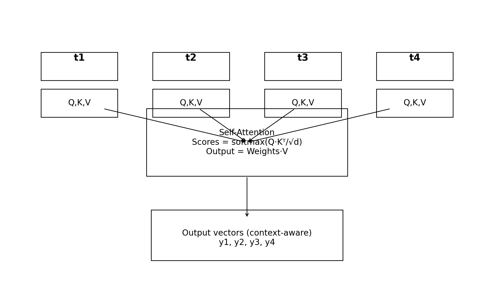
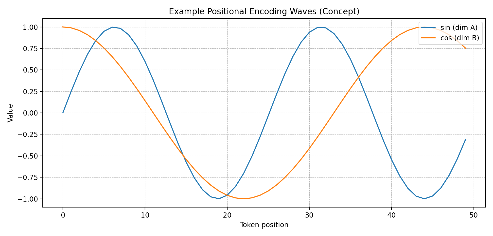

## What is a Transformer?
A **Transformer** is a deep learning model made for working with **sequences**, like text, logs, or network events. It became popular because it can learn relationships between tokens **in parallel**, not only step-by-step like older RNN models. The main idea is **attention**: the model looks at all tokens and decides which ones are important for understanding the current token.

A Transformer usually has:
- **Embedding layer** (turns tokens into vectors)
- **Positional Encoding** (adds position information)
- **Encoder blocks** (good for understanding input)
- (Sometimes) **Decoder blocks** (good for generating output)
- **Feed-Forward layers** (extra processing for each token)

---

## Attention Layer Mechanism (Visualization)
In **self-attention**, each token creates three vectors: **Q (Query)**, **K (Key)**, and **V (Value)**. The model compares Q and K to make attention weights, then uses these weights to mix V vectors and create context-aware outputs.

A simple idea is: *if a token is important for another token, it gets a higher weight.*

---

## Positional Encoding (Visualization)
Attention alone does not know token order. So Transformers add **positional encoding** to each token embedding.

We can think like this:

- embedding = meaning
- positional encoding = position
- input to model = **embedding + position**

Below is a concept visualization of sine/cosine waves often used for positional encodings.

---

## Applications of Transformers in Cybersecurity
Transformers are very useful in cybersecurity because they can learn **context** and **long-range patterns** from large data sources.

### Common Uses
- **Phishing and spam detection:** understand email text, URLs, and writing patterns.
- **Malware analysis:** classify code snippets, API call sequences, or behavior logs.
- **Intrusion detection (IDS):** find suspicious sequences in network flows and alerts.
- **Log anomaly detection:** detect rare patterns in SIEM logs (Windows events, syslog).
- **Threat intelligence:** extract entities like IPs, domains, and CVEs from reports.
- **SOC assistant tools:** summarize incidents and suggest next actions.

### Why It Works Well
- It learns relations across many events, not only neighbor events.
- It can combine text with metadata (time, user, host, process).
- It can be fine-tuned for a company environment and known attack patterns.

---

## Limitations (Important)
Transformers can be expensive to run and may need a lot of training data. Also, attackers can try small changes (like changing phishing words) to fool models. Because of this, security teams should still use rule-based checks and human review.
