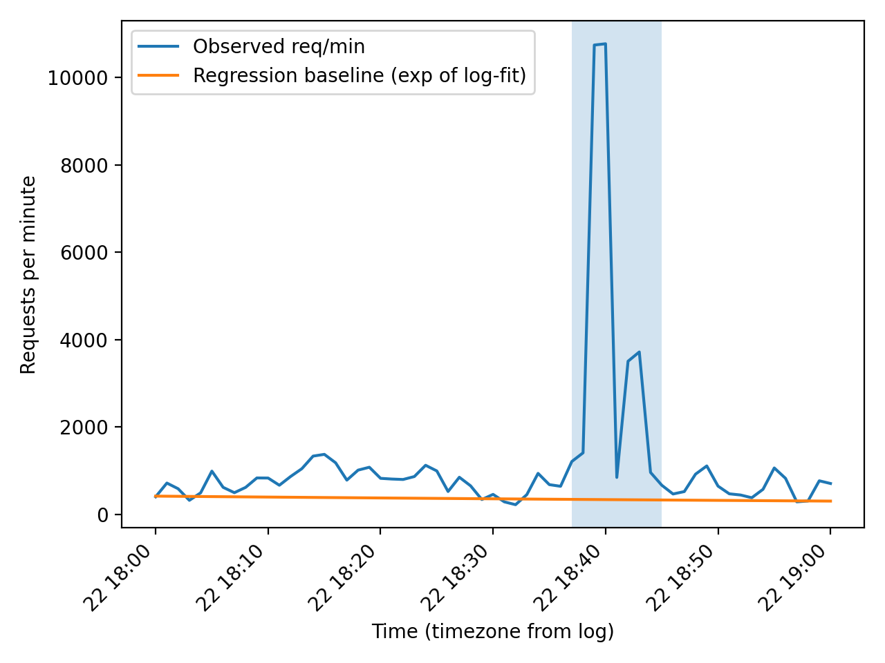
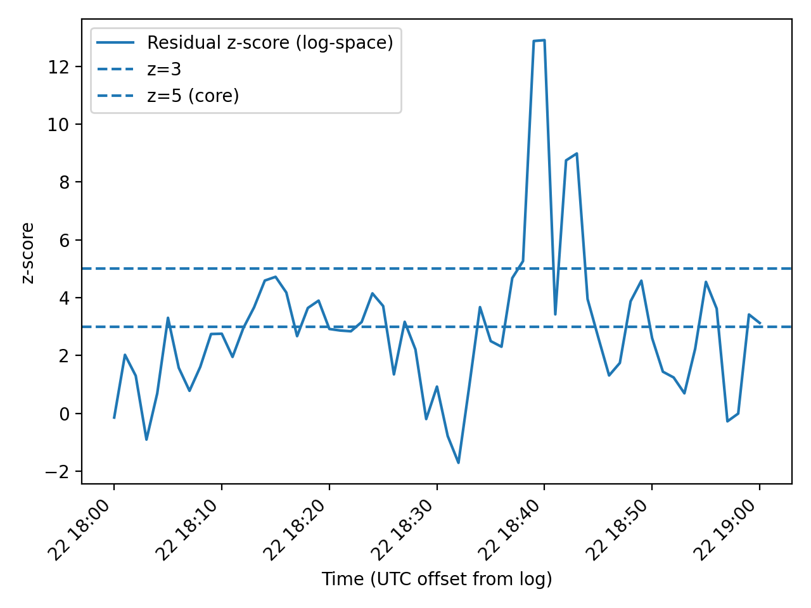

# Task 3 — Detect DDoS time interval(s) using regression analysis

## Dataset (server event log)
- Log file: **`o_tagviashvili25_61845_server.log`**
- Link:  
  [`o_tagviashvili25_61845_server.log`](o_tagviashvili25_61845_server.log)

> The analysis below treats a DDoS attack as a **statistically significant traffic surge** (requests/minute) above a regression-based baseline.

---

## Environment
Tested with Python 3.10+.

```bash
pip install pandas numpy matplotlib
```

---

## 1) Approach (what I did)

1. **Parse timestamps** from each log line (the time is inside square brackets, e.g. `[2024-03-22 18:00:37+04:00]`).
2. **Aggregate traffic volume** as **requests per minute** over the full log duration.
3. Build a **baseline model** of “normal” traffic using **linear regression** on the **log-transformed** counts:

   - Target: `log(1 + requests_per_minute)`
   - Predictor: time index (minute number from the start)
   - Fit is done **robustly** by iteratively excluding the highest positive residuals so that extreme spikes do not dominate the baseline.

4. Compute **residual z-scores** and mark:
   - **core attack minutes**: `z > 5`
   - **expanded attack window**: extend the core window to adjacent minutes where `z > 3` (to capture ramp-up / ramp-down).

---

## 2) Result — DDoS time interval(s)

### Detected DDoS interval (timezone from the log: **UTC+04:00**)
- **Start:** `2024-03-22 18:37:00 +0400`
- **End:** `2024-03-22 18:44:59 +0400`

This interval corresponds to a clear and sustained surge (peak ≈ **10,773 req/min** at **18:40**).

---

## 3) Key code fragments (reproducible)

Create a script, for example: `task_3/ddos_detect.py`

### 3.1 Parse timestamps + aggregate requests/minute
```python
import re
import datetime as dt
from collections import defaultdict
import pandas as pd
import numpy as np

LOG_PATH = "o_tagviashvili25_61845_server.log"

TS_RE = re.compile(r"\[([0-9]{4}-[0-9]{2}-[0-9]{2} [0-9]{2}:[0-9]{2}:[0-9]{2}\+\d{2}:\d{2})\]")

def count_requests_per_minute(path: str):
    counts = defaultdict(int)
    min_dt, max_dt = None, None

    with open(path, "r", errors="ignore") as f:
        for line in f:
            m = TS_RE.search(line)
            if not m:
                continue
            t = dt.datetime.fromisoformat(m.group(1))
            tmin = t.replace(second=0, microsecond=0)
            counts[tmin] += 1
            min_dt = t if (min_dt is None or t < min_dt) else min_dt
            max_dt = t if (max_dt is None or t > max_dt) else max_dt

    idx = pd.date_range(
        min_dt.replace(second=0, microsecond=0),
        max_dt.replace(second=0, microsecond=0),
        freq="min",
        tz=min_dt.tzinfo,
    )
    y = np.array([counts.get(ts.to_pydatetime(), 0) for ts in idx], dtype=float)
    return idx, y
```

### 3.2 Regression baseline (robust linear regression on log-counts)
```python
def robust_log_linear_baseline(y: np.ndarray):
    t = np.arange(len(y), dtype=float)
    logy = np.log1p(y)

    mask = np.ones(len(y), dtype=bool)

    # Iteratively fit and drop the highest positive residuals (robust to spikes)
    for _ in range(10):
        slope, intercept = np.polyfit(t[mask], logy[mask], 1)
        pred = slope * t + intercept
        resid = logy - pred

        # drop top 15% positive residuals from the fit set
        thr = np.quantile(resid[mask], 0.85)
        newmask = mask & (resid <= thr)
        if newmask.sum() == mask.sum():
            break
        mask = newmask

    pred = slope * t + intercept
    return pred, mask
```

### 3.3 Residual z-scores + interval extraction
```python
def detect_attack_minutes(idx, y, pred_log, fit_mask):
    logy = np.log1p(y)
    resid = logy - pred_log

    # Robust scale estimate using MAD
    med = np.median(resid[fit_mask])
    mad = np.median(np.abs(resid[fit_mask] - med))
    sigma = 1.4826 * mad if mad > 0 else resid[fit_mask].std()

    z = resid / sigma

    core = z > 5           # very strong anomalies
    expanded = core.copy() # expand to include nearby z>3 minutes

    for i in range(len(z)):
        if core[i]:
            j = i - 1
            while j >= 0 and z[j] > 3:
                expanded[j] = True
                j -= 1
            j = i + 1
            while j < len(z) and z[j] > 3:
                expanded[j] = True
                j += 1

    # Convert boolean minutes to time intervals
    intervals = []
    i = 0
    while i < len(expanded):
        if not expanded[i]:
            i += 1
            continue
        start = idx[i]
        while i + 1 < len(expanded) and expanded[i + 1]:
            i += 1
        end = idx[i] + pd.Timedelta(minutes=1) - pd.Timedelta(seconds=1)
        intervals.append((start, end))
        i += 1

    return z, intervals
```

---

## 4) Visualizations

Place the generated plots in `task_3/` and embed them here.

### Requests per minute with regression baseline


### Residual z-scores (attack detection threshold)


---

## 5) Full run instructions

1. Put the log file in the repo so the link works:
   - `o_tagviashvili25_61845_server.log` in the repository root  
     (or change `LOG_PATH` accordingly).
2. Run:
```bash
python task_3/ddos_detect.py
```
3. The script should:
   - print the detected attack interval(s)
   - save plots into `task_3/`:
     - `requests_per_minute_regression.png`
     - `residual_zscore.png`

---

## Appendix — quick sanity check (numbers)
- Log duration: **2024-03-22 18:00:01 +0400 → 19:00:59 +0400**
- Total requests parsed: **71,225**
- Peak traffic minute: **2024-03-22 18:40 +0400** with **10,773 requests/min**

